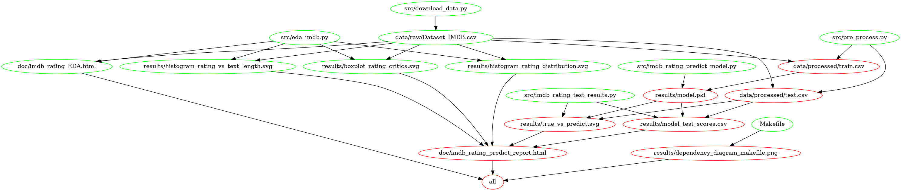

# Movie Review Rating Predictor


### Group repository for DSCI 552, Group 26
### Authors: Yuanzhe Marco Ma, Arash Shamseddini, Kaicheng Tan, Zhenrui Yu
### Nov.-Dec. 2020

## Objectives
In this project we tend to build a Regression model that uses the [Support Vector Machines](https://scikit-learn.org/stable/modules/svm.html) (SVMs) with RBF kernel algorithm to predict the rating of movies based on the review made. For this aim, we will be using a dataset called “Dataset_IMDB” from [SentimentDictionaries](https://github.com/nproellochs/SentimentDictionaries) library compiled by Nicolas Pröllochs and Stefan Feuerriegel Copyright © under the MIT License. [Here](https://github.com/nproellochs/SentimentDictionaries/blob/master/Dataset_IMDB.csv) is a direct link to the dataset which is sourced open on github.com.
The main objective of this study is to answer the following predictive question using our model:


“Given a review of a specific movie from one of the critics of the list below, what is the critic’s rating of the movie based on a number between 0 and 10?”

| Critics   |       
|----------|
| Dennis Schwartz |  
| James Berardinelli |   
| Scott Renshaw | 
| Steve Rhodes | 

This study is in fact based on Sentiment Analysis (SA) through regression approach. Sentiment Analysis or Opinion Mining (OM) is the computational study of people’s opinions, attitudes and emotions toward an entity. The entity can represent individuals, events or topics. These topics are most likely to be covered by reviews.

## Dataset
The “Dataset_IMDB” is a mid-sized dataset of 5006 movie reviews from the four critics. It has four columns as shown in below table.

|  Column Name	 | Column Type	 |  Description |  
|---|---|---|
|  Id |  Numeric | Unique ID assigned to each observation|
|   Text|  Free Text	 | Body of the review content|
|  Author | Categorical  | Author's name of the review|
|  Rating | Numeric  | Ratings given along with the review|


## Analysis
For the purpose of this project, we will use SVM with RBF kernel algorithm for our model. We have split the dataset into 80-20 % proportion for the training and test splits respectively. We have built our model using the training portion to come up with the best predictor. Next, we have examined the model using the test split to evaluate its performance. The results of the analysis is in the Report folder [here](https://github.com/UBC-MDS/group_26). These include, but are not limited to, tabeles that summarize the prediction scores as well as figures that show the relation between explanatory variables and the response, interactively.

We will go further with our analysis and use other regression models to predict the ratings and make comparison with the SVM in terms of accuracy and other metrics.

## Exploratory Data Analysis
The Exploratory Data Analysis (EDA) for this project can be found [here](https://ubc-mds.github.io/group_26/doc/imdb_rating_EDA.html) which contains statistical information of the dataset presented in both tables and plots. As an example we have included:

1- A histogram to illustrate the distribution of the ratings.

2- A table that lists the 20 "most frequent" words appeared in all reviews.

3- A chart to depict the relation between the length of the reviews and the scored rating.

Report for different machine learning model comparison can be found [here](https://ubc-mds.github.io/group_26/doc/model_comparison.html)

## Report
The final report can be found [here](https://ubc-mds.github.io/group_26/doc/imdb_rating_predict_report.html)

## Usage
There are two suggested ways to run the analysis:

### Using Docker
- Clone this repository
- Install [Docker](https://www.docker.com/get-started) onto your machine
- Run the following shell command from the root directory of this project:
  ```shell
  docker run --rm -v $(pwd):/home/source ericyzr/group_26 make all
  ```

To clean up the repository to its initial state:
- Run the following command from the root directory of this project:
  ```shell
  docker run --rm -v $(pwd):/home/source ericyzr/group_26 make clean
  ```

### Without Using Docker
- Clone this repository
- Install the [dependencies](#dependencies) listed below
- Run the following shell command from the root directory of this project:
  ```shell
  make all
  ```

To clean up the repository to its initial state:
- Run the following command from the root directory of this project:
  ```shell
  make clean
  ```

## Dependency diagram of Makefile


## Dependencies
Python 3.8 and Python packages:
```
altair=4.1.*

altair_saver=0.5.*

docopt=0.6.*

jupyterlab=2.2.*

nltk=3.4.*

numpy=1.19.*

pandas=1.1.*

pandas-profiling=2.9.*

scikit-learn=0.23.*
```

## References
1- Varada Kolhatkar. 2020, “MDS Machine Learning Repository.” University of British Columbia, Vancouver, (https://github.ubc.ca/MDS-2020-21/DSCI_571_sup-learn-1_students)

2- Dua, Dheeru, and Casey Graff. 2017. “UCI Machine Learning Repository.” University of California, Irvine, School of Information; Computer Sciences. (http://archive.ics.uci.edu/ml)

3- Gareth James, Daniela Witten, Trevor Hastie and Rob Tibshirani, 2009, “An Introduction to Statistical Learning with Application in R”, Springer Publishing

4- Walaa Medhat, Ahmed Hassan and Hoda Korashy, 2014, “Sentiment analysis algorithms and applications: A survey”, Elsevier Publishing
